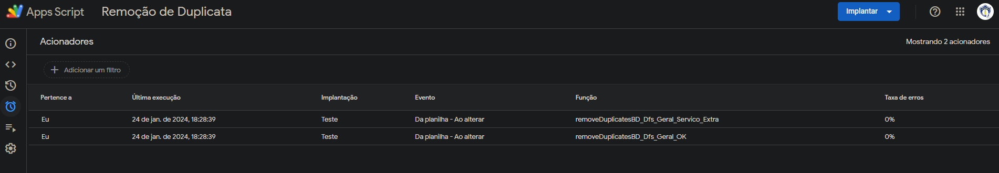
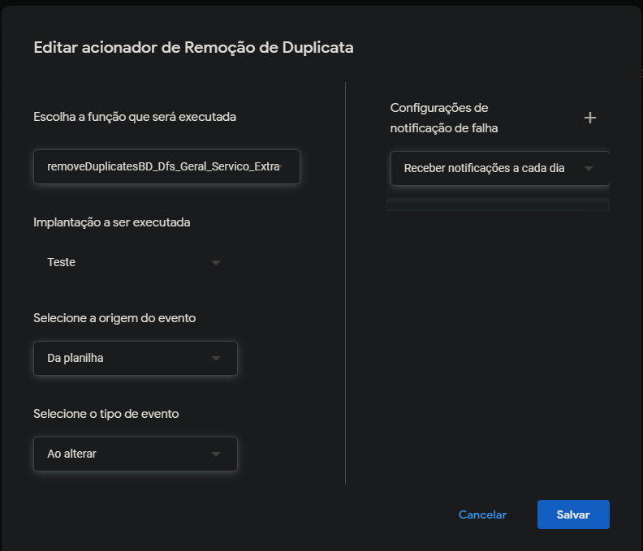

# ConnectAppScriptGoogle
 
### Nessa compilação é possível realizar a conexão do vsCode com o AppScript do Google, segue alguns passos a serem seguidos:

#### 1° Criar uma planilha e um projeto no Google Office;
#### 2° Instalar o Node;

### Após os passos anteriores, você poderá abrir o vsCode e executar os seguintes comandos:

#### $ npm init
#### $ npm install -g @google/clasp
#### $ npm i -S @types/google-apps-script
#### $ clasp login
#### $ clasp clone "ID DO PROJETO CRIADO"
#### $ clasp push  (PARA ENVIAR DADOS)

### Por fim, qualquer function criada ou comando a ser realizado, você pode estar executando um $ clasp push para realizar a publicação na nuvem do AppScript.

#### __________________________________________________________

# Explicando Código.js

#### O intuito desta criação é basicamente deletar as duplicadas contidas em uma certa aba de sheet. A ideia é adicionar acionadores para executar diariamente as duas functions criadas e eleminar as duplicadas que são preenchidas no sheet.

#### Acionadores: 

#### Executar diáriamente a cada preenchimento realizado pelo usuário.

